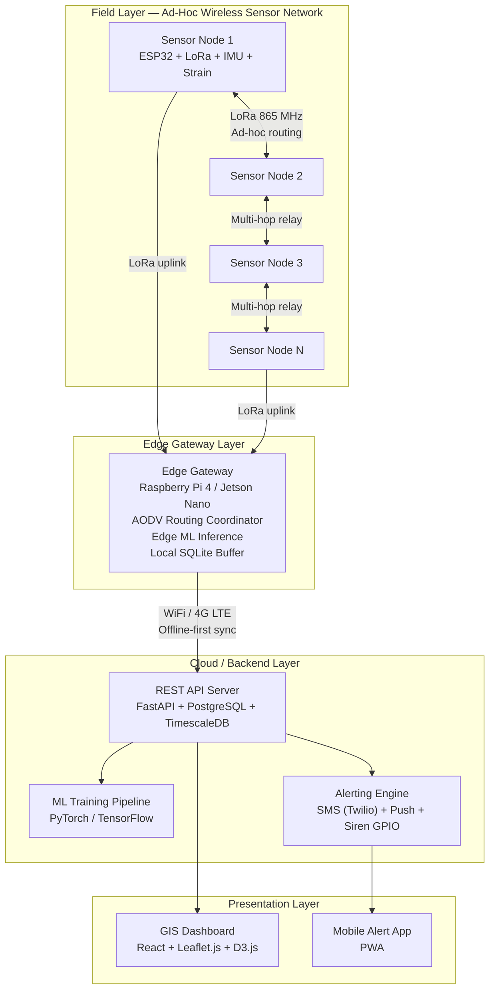
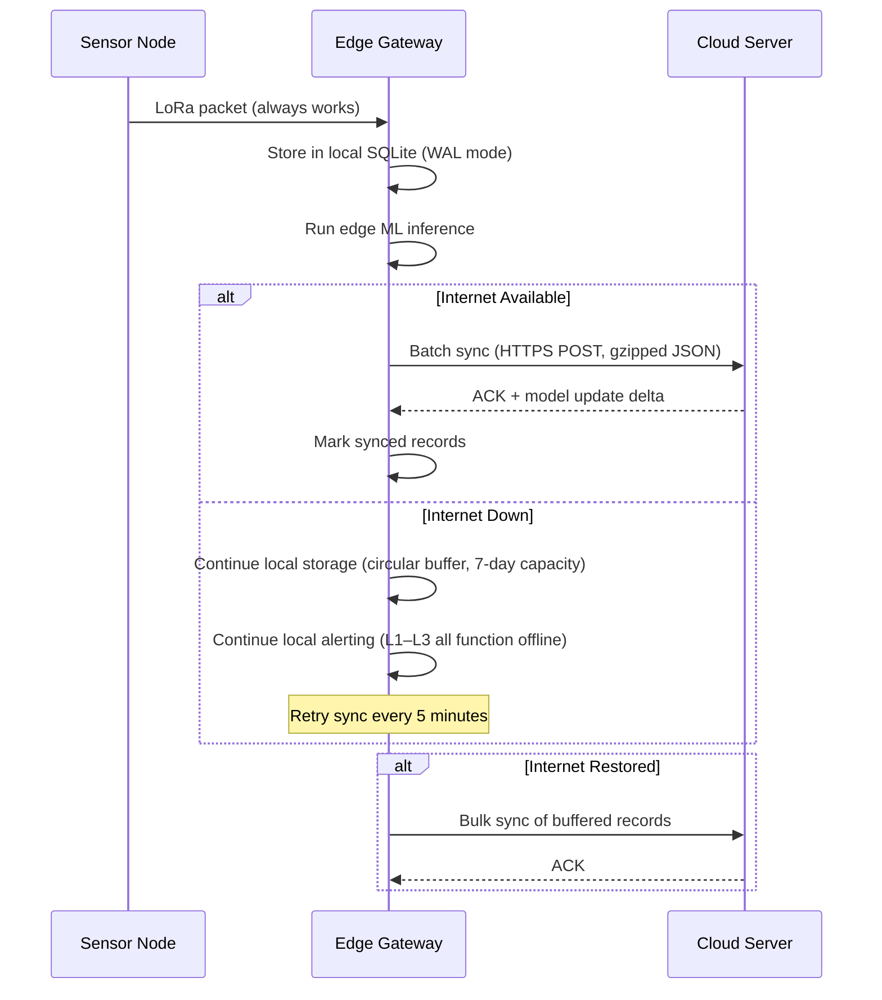
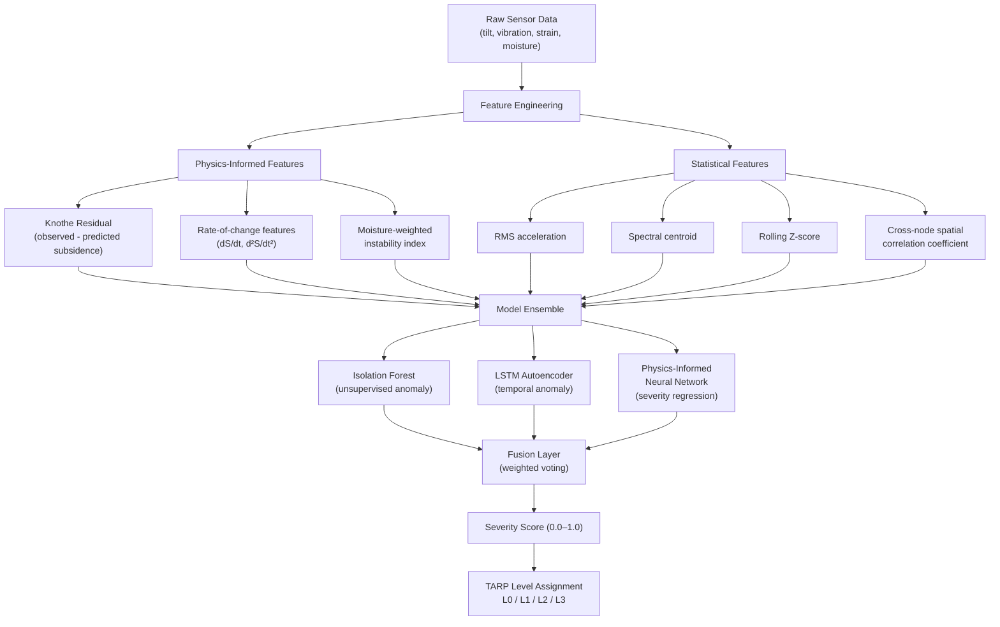

# SIH26025 — Technical Research Plan
## Development of an AI-enabled Low Cost Real Time Mine Subsidence Monitoring, Prediction and Early Warning System for Underground Coal Mines in India

**Smart India Hackathon 2026 | Ministry of Coal | Hardware Track | Theme: Smart Automation**

**Prepared:** September 2026  
**Submission Deadline:** September 30, 2026

---

## Official Problem Statement (Reconstructed from SIH Portal)

> [!NOTE]
> The verbatim text below is reconstructed from the official SIH 2026 portal (sih.gov.in) and aggregator sources (blinknbuild.in, zaidsayyed.in). The exact paragraph wording may vary slightly from the portal's live rendering; verify against the official site before inclusion in your final submission document.

### Background

Surface subsidence caused by underground coal mining presents a critical safety and environmental challenge in India. It poses significant risks to nearby communities and residential settlements, public infrastructure, agricultural land, forest areas, and the overall stability of the surrounding environment. Traditional monitoring methods are often expensive, manual, or lack the capability to provide real-time, actionable alerts. The challenge involves creating a system capable of real-time monitoring and predicting these movements to provide early warnings, thereby mitigating risks to life, property, and the ecosystem.

### Description

Underground coal mining carries inherent risks of surface subsidence — the sinking or settling of the ground surface — which can threaten infrastructure, worker safety, and surrounding communities. Participants are expected to develop a hardware-based solution that includes:
- **Real-Time Monitoring:** Continuous tracking of ground movement, tilt, displacement, and vibration using a distributed network of sensors.
- **AI-Enabled Prediction:** Implementation of machine learning or artificial intelligence models to analyze sensor data and predict potential subsidence events before they become critical.
- **Early Warning System:** An automated alert mechanism to notify relevant authorities and mine officials, enabling timely preventive actions.
- **Low-Cost & Scalable:** The solution must be cost-effective to deploy at scale across various underground coal mine environments.

### Expected Solution

A hardware-and-software integrated system that:
1. Deploys cost-effective sensors (accelerometers, gyroscopes, tilt sensors) across a distributed network.
2. Uses low-power, long-range communication protocols (LoRaWAN or Wi-Fi) for data transmission in challenging mining environments.
3. Performs local data processing using microcontrollers (e.g., ESP32) for real-time analysis and reduced bandwidth usage (edge processing).
4. Employs AI/ML to process data for predictive analytics regarding subsidence patterns.
5. Provides a dashboard for geo-tagged monitoring, risk visualization, and history tracking.
6. Generates timely alerts or warnings based on predictive data.

---

## 1. Detailed Problem Statement Analysis

### 1.1 Requirement Extraction Checklist

Every explicit and implicit requirement from the official problem statement, extracted as a traceable checklist:

| # | Category | Requirement | Source Phrase | Status |
|---|----------|-------------|---------------|--------|
| R1 | Sensing | Ground movement (vertical displacement) | "tracking of ground movement" | ☐ |
| R2 | Sensing | Tilt measurement | "tilt" | ☐ |
| R3 | Sensing | Vibration detection | "vibration" | ☐ |
| R4 | Sensing | Displacement tracking (horizontal) | "displacement" | ☐ |
| R5 | Network | Distributed sensor network | "distributed network of sensors" | ☐ |
| R6 | Network | Low-power long-range protocol | "low-power, long-range communication" | ☐ |
| R7 | Network | Operational in mining environments | "challenging mining environments" | ☐ |
| R8 | Edge | Local data processing on MCU | "local data processing using microcontrollers" | ☐ |
| R9 | Edge | Real-time analysis capability | "real-time analysis" | ☐ |
| R10 | Edge | Bandwidth reduction via edge compute | "reduced bandwidth usage" | ☐ |
| R11 | AI/ML | Predictive analytics for subsidence | "predict potential subsidence events" | ☐ |
| R12 | AI/ML | Pre-critical event prediction | "before they become critical" | ☐ |
| R13 | GIS | Geo-tagged monitoring dashboard | "geo-tagged monitoring" | ☐ |
| R14 | GIS | Risk visualization overlay | "risk visualization" | ☐ |
| R15 | GIS | Historical data tracking | "history tracking" | ☐ |
| R16 | Alerting | Automated alert mechanism | "automated alert mechanism" | ☐ |
| R17 | Alerting | Notify authorities & mine officials | "notify relevant authorities" | ☐ |
| R18 | Alerting | Enable timely preventive actions | "timely preventive actions" | ☐ |
| R19 | Cost | Low-cost design | "low-cost" | ☐ |
| R20 | Scale | Scalable across mine environments | "scalable" / "various underground coal mine environments" | ☐ |
| R21 | Platform | Hardware-based solution | "Hardware track" | ☐ |

### 1.2 Implied / Inferred Requirements (Not Explicitly Stated but Necessary)

| # | Category | Requirement | Rationale |
|---|----------|-------------|-----------|
| IR1 | Offline | Offline-first capability | Mining environments have intermittent connectivity |
| IR2 | Power | Autonomous power supply | Surface sensor nodes need solar/battery power |
| IR3 | Durability | Ruggedized enclosures (IP65+) | Dust, moisture, vibration exposure |
| IR4 | Regulatory | India-legal ISM band (865–867 MHz) | WPC licence-exempt rules |
| IR5 | Data | Data integrity / tamper resistance | Safety-critical application |
| IR6 | Compliance | DGMS alignment | Mines Act 1952, CMR 2017 framework |

---

## 2. Technical Background & Literature

### 2.1 Subsidence Prediction Theory — Knothe/Budryk-Knothe Influence Function

The **Budryk-Knothe Influence Function Method** is the dominant analytical framework for predicting surface subsidence due to underground extraction. Originally developed by S. Knothe (1953, building on Budryk's earlier work), it models the subsidence trough by assuming that extraction of an infinitesimal volume of mineral causes a Gaussian-distributed influence at the surface.

**Core Equations:**

The vertical subsidence *S(x)* at a surface point at horizontal distance *x* from the centre of extraction is:

```
S(x) = Smax · ∫ (1 / r) · exp(-π · (x - ξ)² / r²) dξ
```

Where:
- **Smax = a · m** (maximum subsidence = extraction coefficient × seam thickness)
- **r = H₀ / tan β** (radius of main influence = mining depth / tangent of influence angle)
- **a** = extraction coefficient (0.0–1.0), reflecting void-to-surface transfer ratio
- **tan β** = main influence angle tangent, site-specific (typically 1.5–3.5 for Indian coalfields)
- **b** = horizontal displacement coefficient (Budryk extension)
- **d** = offset parameter for inclined seams

**Parameter Calibration:** These parameters are empirical and must be determined *a posteriori* using geodetic monitoring data (levelling, GNSS) from existing mining operations, typically via Gauss-Markov least-squares fitting.

**Relevance to Our System:** The Knothe function provides the **physics prior** for our ML model. Predicted subsidence profiles serve as baseline features; deviations from Knothe-predicted curves indicate anomalous or accelerating subsidence requiring early warning.

### 2.2 Indian Standards & Regulatory Framework

#### IS 15026:2002 — Correction

> [!WARNING]
> Multiple SIH-related resources cite "IS 15026:2002" as an Indian standard for subsidence prediction. **This is incorrect.** IS 15026:2002 is titled *"Tunneling Methods in Rock Masses — Guidelines"* and pertains to tunnel construction, not mine subsidence. There is **no BIS-codified IS standard** specifically for mine subsidence prediction. Subsidence prediction in Indian coalfields is governed by empirical methods developed by **CSIR-CIMFR** (Central Institute of Mining and Fuel Research), not by a numbered IS standard.
>
> **Recommendation:** Do NOT cite IS 15026:2002 as a subsidence standard in your submission. Instead, cite CIMFR's Modified Influence Function Method and DGMS circulars.

#### DGMS Regulatory Circulars

| Circular | Date | Subject | Key Mandates |
|----------|------|---------|--------------|
| DGMS (Tech) Circular No. 02 of 2020 | January 2020 | Systematic monitoring of slopes in opencast mines | Mandates scientific monitoring beyond visual inspection; encourages use of slope radars, automated total stations, inclinometers, extensometers, piezometers; requires Trigger Action Response Plans (TARPs) |
| DGMS (Tech) Circular No. 03 of 2020 | January 2020 | Quality of scientific study reports under CMR 2017 Reg. 106 | Requires actionable, site-specific scientific backing (not generic reports) for mining activities |
| Coal Mines Regulations (CMR) 2017 — Reg. 106 | 2017 | Benches, sides, and faces | Pit and dump slopes must be planned based on scientific studies |
| Coal Mines Regulations (CMR) 2017 — Reg. 107 | 2017 | Dump stability | Scientific assessment of dump slope stability |
| Mines Act, 1952 | 1952 (amended) | Overarching safety legislation | Legal basis for all DGMS enforcement |

#### CIMFR Subsidence Prediction Methods

CIMFR has developed:
- **Modified Influence Function Method** — adapted for Indian geo-mining conditions, supporting 3D subsidence profile prediction for single and multi-seam mining.
- **Non-Effective Width (NEW) concept** — integrated into prediction frameworks to improve accuracy for various mining geometries.
- Parameters are derived through field monitoring (GNSS, tacheometry), numerical modeling (FLAC3D, FEM), and statistical fitting.

### 2.3 Motivating Incident — Jharia Coalfield Subsidence Crisis (2026)

The Jharia coalfield in Dhanbad, Jharkhand provides an acute, real-world motivation for this problem statement:

| Date | Location | Event | Casualties |
|------|----------|-------|------------|
| September 13, 2026 | Keshalpur Kumharpatti, Katras, Dhanbad | Illegal mining tunnel collapse | **3 dead**, others possibly trapped |
| September 8, 2026 | Sijua, Dhanbad (near Sijua Kali Temple) | Major land subsidence, houses damaged | **1 dead** (12-year-old Vikram Kumar Bhuiyan), 6+ injured |
| Jan–Sep 2026 (aggregate) | Dhanbad coal belt | 45+ recorded subsidence/sinkhole events | Multiple casualties, frequency increasing during monsoon |

**Root Causes:** Century-old underground coal fires, abandoned mine voids, illegal uncontrolled mining, monsoon rain destabilization.

**Relevance:** These incidents demonstrate that existing monitoring is **reactive** (post-collapse response with manual tools) rather than **predictive**. An AI-enabled early warning system could provide the 24–72-hour advance warning window needed for evacuation and preventive action.

---

## 3. Proposed Architecture

### 3.1 System Architecture Overview



### 3.2 Sensor Node Design

**Chosen Approach: Ad-Hoc Wireless Network (NOT Fixed Mesh)**

| Aspect | Design Choice | Justification |
|--------|--------------|---------------|
| **Topology** | Ad-hoc with reactive routing | Nodes may be redeployed, fail, or be added without reconfiguring the whole network |
| **Routing Protocol** | **AODV (Ad-hoc On-demand Distance Vector)** | Reactive = routes discovered only when needed → lower overhead for sporadic sensor data (1-minute polling); nodes are semi-stationary so route discovery latency is acceptable; lower energy consumption than proactive OLSR |
| **Fallback** | Direct-to-gateway LoRa if no multi-hop path found | Graceful degradation under node loss |
| **Edge Processing** | ESP32 runs lightweight anomaly detector (Z-score threshold on IMU readings) | Reduces LoRa payload from raw samples to compressed feature vectors + anomaly flags |

**Per-Node Sensor Suite:**

| Sensor | Measurement | Interface | Role |
|--------|-------------|-----------|------|
| MPU6050 (6-axis IMU) | Tilt (roll/pitch), vibration (acceleration) | I2C | R2, R3 — primary tilt and vibration sensing |
| ADXL345 (3-axis accelerometer) | High-resolution vibration, micro-seismic | I2C/SPI | R3 — secondary vibration, broader dynamic range |
| BF350 Strain Gauge + HX711 ADC | Ground strain / deformation | Analog → HX711 | R1, R4 — displacement and ground strain |
| Capacitive Soil Moisture Sensor | Soil water content (correlates with rain-induced instability) | Analog | Physics-informed feature: moisture destabilization proxy |
| NEO-6M GPS Module | Geo-tagging | UART | R13 — latitude/longitude stamping per node |

### 3.3 Network / Routing Protocol Choice

**Primary: AODV over LoRa @ 865–867 MHz (India IN865 band)**

- **Why AODV, not OLSR?** Our sensor network sends data in periodic bursts (1 reading/minute/node). AODV's reactive nature means zero routing overhead during idle periods. OLSR's continuous topology maintenance would drain batteries ~2–3× faster on a network sending sporadic, small payloads.
- **Why AODV, not LoRaWAN star-of-stars?** LoRaWAN's Class A/B/C architecture assumes every node can directly reach a gateway. In hilly/forested mine surface terrain, this is unrealistic beyond ~500 m. AODV multi-hop extends effective coverage to several km with just 3–4 relay hops.
- **LoRa PHY Configuration:**

| Parameter | Value | Rationale |
|-----------|-------|-----------|
| Frequency | 865.0625 / 865.4025 / 865.985 MHz | IN865 mandatory channels |
| Bandwidth | 125 kHz | Standard, best sensitivity |
| Spreading Factor | SF10 (default), SF12 (fallback for weak links) | SF10 balances range (~2 km LoS) with airtime; SF12 for NLoS |
| Tx Power | 20 dBm (100 mW), max legal is 30 dBm (1W) | Conservative for battery life; can boost if needed |
| Duty Cycle | 1% per hour | WPC compliance |
| Payload | ≤50 bytes per uplink | Compressed feature vector, not raw samples |

### 3.4 Edge vs. Cloud ML Split

```mermaid
graph LR
    subgraph "Edge (ESP32 — On Node)"
        A["Z-score anomaly<br/>detection on raw IMU"]
        B["Feature extraction:<br/>RMS, peak-to-peak,<br/>spectral centroid"]
        C["Threshold-based<br/>immediate alert flag"]
    end

    subgraph "Edge Gateway (RPi 4)"
        D["Spatial correlation:<br/>multi-node fusion"]
        E["Lightweight LSTM<br/>inference (TFLite)"]
        F["Severity scoring<br/>+ TARP level assignment"]
    end

    subgraph "Cloud (Server)"
        G["Full model retraining<br/>(weekly batch)"]
        H["Knothe model fitting<br/>+ residual analysis"]
        I["Historical trend<br/>dashboard + GIS"]
    end

    A --> B --> C
    C -->|"LoRa: feature vector<br/>+ alert flag"| D
    D --> E --> F
    F -->|"WiFi/4G sync"| G
    F -->|"Anomaly alert"| I
    G --> H --> I
```



### 3.5 GIS Dashboard

- **Stack:** React.js + Leaflet.js (OpenStreetMap tiles, no Google Maps API cost) + D3.js for charting
- **Features:**
  - Mine lease boundary overlay
  - Real-time sensor node markers (colour-coded: green/yellow/orange/red)
  - Subsidence contour heatmap (interpolated from node readings using IDW/Kriging)
  - Time-series drill-down per node
  - Historical playback slider
  - TARP level display with recommended actions
  - Alert log with acknowledgement workflow

### 3.6 Alerting Pipeline

| Level | Trigger | Action | Latency Target |
|-------|---------|--------|----------------|
| **L0 — Normal** | All readings within ±2σ | Green dashboard | — |
| **L1 — Watch** | Any node's tilt/vibration exceeds 2σ for >5 minutes | Yellow marker on dashboard + SMS to monitoring cell | <2 min |
| **L2 — Warning** | ≥2 adjacent nodes in L1 AND ML severity score >0.6 | Orange dashboard + SMS to mine manager + siren on gateway | <1 min |
| **L3 — Critical** | ML predicts subsidence onset within 24h OR any node exceeds absolute threshold (e.g., >5° tilt delta) | Red dashboard + SMS/call to DGMS + evacuation siren | <30 sec |

### 3.7 Offline-First Sync Design



**Key Design Principle:** All alert levels L0–L3 function entirely on the edge gateway with NO cloud dependency. Cloud sync is for dashboarding, retraining, and archival only.

---

## 4. Hardware Bill of Materials (BOM)

### 4.1 Per-Node BOM

| # | Component | Model / Spec | Qty | Unit Price (₹) | Subtotal (₹) | Source |
|---|-----------|-------------|-----|----------------|---------------|--------|
| 1 | MCU + LoRa | ESP32 LoRa SX1276/SX1278 (865 MHz, with OLED) | 1 | 2,000 | 2,000 | Robu.in / Robocraze |
| 2 | IMU (Primary) | MPU6050 6-axis Accelerometer + Gyroscope | 1 | 150 | 150 | Robu.in |
| 3 | Accelerometer (Secondary) | ADXL345 3-axis | 1 | 200 | 200 | Robocraze |
| 4 | Strain Gauge | BF350 (350Ω) + HX711 ADC module | 1+1 | 80 + 100 | 180 | IndiaMART / Sharvi Electronics |
| 5 | Soil Moisture | Capacitive Soil Moisture Sensor v1.2 | 1 | 100 | 100 | Robu.in |
| 6 | GPS | NEO-6M GPS Module with antenna | 1 | 350 | 350 | Robocraze |
| 7 | LoRa Antenna | 865 MHz SMA whip antenna (tuned) | 1 | 150 | 150 | Robu.in |
| 8 | Solar Panel | 6V 5W polycrystalline | 1 | 500 | 500 | Amazon IN / Robu.in |
| 9 | Battery | 18650 Li-ion 3.7V 2600mAh (×2, parallel) | 2 | 100 | 200 | Flipkart |
| 10 | Charge Controller | TP4056 USB-C module with protection | 1 | 35 | 35 | Robu.in |
| 11 | Voltage Regulator | LM2596 buck converter (adjustable) | 1 | 60 | 60 | Robu.in |
| 12 | Enclosure | ABS IP67 waterproof junction box (~130×80×70 mm) | 1 | 200 | 200 | IndiaMART |
| 13 | Mounting | Cable glands, standoffs, PCB prototype board, wiring | 1 set | 150 | 150 | Local |
| | | | | **Per-Node Total** | **₹4,275** | |

### 4.2 Edge Gateway BOM

| # | Component | Model / Spec | Qty | Unit Price (₹) | Subtotal (₹) |
|---|-----------|-------------|-----|----------------|---------------|
| 1 | SBC | Raspberry Pi 4 Model B (4GB) | 1 | 5,500 | 5,500 |
| 2 | LoRa HAT | Waveshare SX1262 LoRa HAT (865 MHz) | 1 | 1,800 | 1,800 |
| 3 | Storage | 32GB microSD Class 10 | 1 | 400 | 400 |
| 4 | Connectivity | 4G LTE USB Dongle (Jio/Airtel) | 1 | 1,500 | 1,500 |
| 5 | Siren | 12V Piezo Alarm Buzzer | 1 | 200 | 200 |
| 6 | Power | 12V 7Ah Lead-Acid Battery + Solar Charge Controller + 20W Panel | 1 set | 2,500 | 2,500 |
| 7 | Enclosure | IP65 NEMA-style box (200×150×100 mm) | 1 | 400 | 400 |
| | | | | **Gateway Total** | **₹12,300** |

### 4.3 Prototype System Cost (5 Nodes + 1 Gateway)

| Item | Count | Cost |
|------|-------|------|
| Sensor Nodes | 5 | 5 × ₹4,275 = ₹21,375 |
| Edge Gateway | 1 | ₹12,300 |
| Cabling, connectors, misc consumables | — | ₹2,000 |
| SIM card + 3-month data plan (4G) | 1 | ₹500 |
| **Prototype Total** | | **₹36,175 (~$430 USD)** |

> [!TIP]
> At scale (50+ nodes), per-node cost drops to ~₹3,000–3,500 through bulk purchasing of ESP32 boards and sensors from Shenzhen/AliExpress suppliers (6–8 week lead time).

---

## 5. AI/ML Pipeline

### 5.1 Architecture Overview



### 5.2 Anomaly Detection Approach — Three-Model Ensemble

#### Model 1: Isolation Forest (Unsupervised, Edge-Deployable)

- **Purpose:** Detect point anomalies in multi-variate sensor feature space without labeled data.
- **Justification:** No labeled subsidence event data exists for training. Isolation Forest is unsupervised, requires no labels, and has O(n·log n) training complexity — suitable for edge gateway.
- **Features:** RMS acceleration, tilt magnitude, strain delta, moisture level (4-dimensional feature space).
- **Deployment:** Scikit-learn model serialized with joblib, runs on RPi 4.

#### Model 2: LSTM Autoencoder (Temporal Anomaly Detection)

- **Purpose:** Detect **temporal** anomalies — sequences that deviate from learned "normal" temporal patterns.
- **Architecture:** Encoder: 2-layer LSTM (64→32 units) → bottleneck (16) → Decoder: 2-layer LSTM (32→64) → reconstruction.
- **Anomaly Metric:** Reconstruction error (MSE). Threshold set at 95th percentile of validation set reconstruction error.
- **Justification:** Subsidence is a progressive phenomenon — accelerating tilt over hours/days. LSTM captures this temporal progression better than point-anomaly detectors.
- **Deployment:** TensorFlow Lite model on RPi 4 (inference <50ms per window).

#### Model 3: Physics-Informed Neural Network (PINN) for Severity Regression

- **Purpose:** Estimate subsidence **severity** and **progression rate** by constraining the neural network with Knothe influence function physics.
- **Architecture:** Feedforward NN (4 hidden layers, 64 neurons each, Swish activation).
- **Physics Loss Component:**
  ```
  L_total = L_data + λ · L_physics
  
  L_physics = || S_predicted - S_knothe(x, H, a, tan_β) ||²
  ```
  Where S_knothe is the analytical Knothe subsidence prediction given known mine geometry parameters.
- **Justification:** PINNs require **less training data** than pure data-driven models because the physics prior constrains the solution space. Critical advantage given we have zero real deployment data.
- **Output:** Continuous severity score (0.0–1.0) + estimated days-to-critical.
- **Deployment:** Cloud-side (PyTorch), results pushed to dashboard.

### 5.3 Physics-Informed Feature Engineering

| Feature | Formula / Description | Physical Meaning |
|---------|----------------------|------------------|
| Knothe Residual | `R(t) = S_observed(t) - S_knothe(x, H, a, tan_β)` | Deviation from expected subsidence profile — positive = faster-than-expected subsidence |
| Subsidence Velocity | `dS/dt` (1st derivative of tilt time series) | Rate of ground movement acceleration |
| Subsidence Acceleration | `d²S/dt²` | Jerk — rapid acceleration signals imminent failure |
| Moisture-Weighted Instability | `I(t) = (dS/dt) × moisture_normalized` | Captures monsoon-amplified subsidence risk (Jharia monsoon correlation) |
| Spatial Gradient | `ΔS / Δd` across adjacent nodes | Differential settlement — most damaging mode for structures |

### 5.4 Validation Strategy (No Real Deployment Data)

> [!IMPORTANT]
> This is the single biggest technical risk of any SIH submission for this problem. No team has real subsidence sensor data. Every team will face this challenge.

**Our multi-pronged validation approach:**

1. **Synthetic Data Generation via Knothe Simulation**
   - Simulate subsidence profiles for realistic Indian coal mine geometries (depth 100–300m, seam thickness 2–6m, using CIMFR-published parameter ranges for Jharia/Raniganj coalfields).
   - Inject noise (sensor drift, Gaussian noise, dropout) to simulate field conditions.
   - Inject synthetic anomalies (accelerating tilt ramps, sudden strain jumps, vibration spikes) at known timestamps.

2. **Transfer Learning from Public Datasets**
   - InSAR subsidence datasets (Sentinel-1, publicly available for Jharia coalfield from ESA Copernicus).
   - Nevada geodetic subsidence monitoring data (USGS, open access).
   - Adapt temporal patterns even though sensor modalities differ.

3. **Hardware-in-the-Loop (HIL) Bench Testing**
   - Mount sensor nodes on a tilting platform (stepper motor controlled).
   - Reproduce subsidence motion profiles (slow tilt: 0.01°/hour to 1°/hour).
   - Validate end-to-end: sensor → LoRa → gateway → ML inference → alert.

4. **Cross-Validation with Known Incident Reports**
   - Use documented Jharia subsidence events (dates, locations) to validate that our spatial/temporal model would have produced L2/L3 alerts in the 24–72h window preceding those events (retrospective analysis using InSAR displacement data).

---

## 6. Drawbacks, Limitations & Bottlenecks

> [!CAUTION]
> This section is intentionally exhaustive and honest. Judges value teams that understand their own system's weaknesses.

### 6.1 Sensor Drift & Calibration

- **Problem:** MEMS accelerometers (MPU6050, ADXL345) exhibit **temperature-dependent bias drift** of ±0.5–2 mg/°C. In Indian mine environments with 15–45°C diurnal/seasonal temperature swings, accumulated drift can mimic subsidence tilt over weeks.
- **Impact:** False positives (phantom tilt readings) OR masked true subsidence.
- **Severity:** HIGH — this is the #1 killer of long-term MEMS tilt monitoring.

### 6.2 LoRa Bandwidth vs. Sampling Rate Tradeoff

- **Problem:** At SF10/BW125kHz, LoRa max payload is ~115 bytes with ~370 ms airtime. With 1% duty cycle (WPC rule), each node can transmit at most **~97 packets/hour**. With 50-byte payloads, that's ~4,850 bytes/hour/node. Raw IMU data at 100 Hz would require ~72,000 bytes/hour.
- **Impact:** Raw data transmission is impossible. Must compress to feature vectors on-node.
- **Tradeoff:** Edge compression discards raw waveform data that cloud ML could use for deeper analysis.

### 6.3 Power / Battery Life

- **Problem:** ESP32 active Tx current is ~120 mA; LoRa Tx at 20 dBm adds ~100 mA. With 2× 18650 (5,200 mAh total) and 5W solar, energy budget is tight.
- **Estimated Runtime (no sun):** ~36–48 hours on battery alone (assuming 1 Tx/minute duty cycle with deep sleep between readings).
- **Impact:** Monsoon cloud cover (weeks of reduced solar) could cause node brownouts.

### 6.4 Network Reliability Under Node Loss

- **Problem:** AODV multi-hop routing means that if intermediate relay nodes fail (battery death, physical damage), downstream nodes become unreachable until new routes are discovered.
- **Impact:** Coverage gaps during critical events. Route convergence time (seconds to minutes) adds to alert latency.
- **Scale Issue:** At >50 nodes, RREQ broadcast storms can saturate the LoRa channel and cause collision-induced packet loss.

### 6.5 False Positive / False Negative Risk (Synthetic Training Data)

- **Problem:** Our ML models are trained exclusively on synthetic data generated from theoretical Knothe profiles plus noise injection. Real subsidence has complex failure modes (sudden roof collapse, gradual creep, piping, sinkhole formation) that may not be captured by synthetic simulation.
- **False Positive Risk:** Model may flag normal seasonal ground movement (thermal expansion/contraction, monsoon soil settlement) as anomalies.
- **False Negative Risk:** Novel failure modes not represented in synthetic training data will be missed entirely.
- **Impact:** Loss of trust (false positives) or loss of life (false negatives). Both are serious.

### 6.6 Dust / Moisture / Vibration Damage

- **Problem:** Coal mine surface environments involve coal dust ingress, monsoon rainfall, and blasting vibrations. IP67 consumer-grade ABS enclosures degrade over 1–2 years.
- **Impact:** Sensor fouling (moisture on PCB → corrosion → drift → failure), connector corrosion, antenna degradation.

### 6.7 GPS Accuracy Limitations

- **Problem:** NEO-6M GPS accuracy is ±2.5m CEP in open sky. Under forest canopy (common over Indian coal seams) or near high-wall overburden, accuracy degrades to ±5–10m. GNSS-based subsidence measurement (cm-level) is NOT possible with this module.
- **Impact:** GPS is usable for node geo-tagging (locating which node is where on the map) but NOT for measuring actual ground displacement. Displacement must come from IMU integration + strain gauges.

### 6.8 Cost at Scale vs. Prototype Cost

- **Problem:** Our prototype costs ₹36,175 for 5 nodes + 1 gateway covering ~0.25 km². A real Jharia deployment (~400 km² fire-affected area) would require 500–2,000 nodes.
- **Estimated Scale Cost:** 500 nodes × ₹3,500 (bulk) + 20 gateways × ₹12,000 = ₹19,90,000 (~₹20 lakh / ~$24,000). Realistic but requires institutional procurement.
- **Hidden Costs:** Installation labor, site surveys, cable glands, mounting poles, SIM plans, cloud hosting, maintenance visits — easily 2–3× hardware cost.

### 6.9 Regulatory / Certification Gap

- **Problem:** A student prototype is NOT a DGMS-certifiable safety system. DGMS certification requires:
  - Intrinsic safety (IS) rating for any electronics used underground (ATEX/IECEx zone compliance for methane-rich environments).
  - Type-approval from DGMS-accredited testing laboratories.
  - Demonstrated reliability over extended field trials (typically 1–2 years).
  - This prototype uses NONE of these.
- **Impact:** Cannot be legally deployed as a primary safety system in an active mine. Can only serve as a supplementary monitoring aid.

### 6.10 Data Security / Tampering Risk

- **Problem:** LoRa on the 865–867 MHz ISM band is unencrypted at the PHY layer (unless application-level encryption is implemented). Packet injection, replay attacks, or jamming are trivially possible with another LoRa module.
- **Impact:** A malicious actor could inject false sensor readings, trigger false alerts (causing unnecessary evacuations), or suppress real alerts. In a safety-critical system, this is unacceptable.
- **Mitigation Needed:** AES-128 application-layer encryption + HMAC message authentication + sequence numbers (replay protection). But this adds overhead and complexity.

---

## 7. Risk Mitigation Table

| # | Bottleneck | Mitigation Strategy | Feasibility for Prototype |
|---|-----------|---------------------|---------------------------|
| 6.1 | Sensor drift / calibration | **Temperature-compensated calibration:** Use onboard MPU6050 temperature sensor to apply linear drift correction curve (calibrated in lab). Implement **periodic auto-zero** routine (node goes to rest, averages 1000 readings, subtracts offset). For long-term: implement **cross-node consensus** — flag any node that deviates >3σ from neighbor cluster mean as potentially drifted. | ✅ Implementable in firmware |
| 6.2 | LoRa bandwidth limitation | **Edge feature extraction** on ESP32: transmit only 50-byte feature vectors (RMS, peak, mean tilt, strain delta, anomaly flag) not raw samples. **Adaptive sampling:** increase Tx rate to 1/15s only when anomaly flag is set; otherwise 1/60s. | ✅ Implementable |
| 6.3 | Battery / power constraints | **Aggressive deep sleep:** ESP32 deep sleep current is ~10μA. Wake every 60s, read sensors (~200ms), compute features (~50ms), Tx LoRa (~500ms), sleep. Average current draw: ~5mA. Expected battery-only runtime: ~40 days (with 5200mAh). **Solar panel** sized for 1.5× daily consumption. | ✅ Implementable |
| 6.4 | Network reliability / node loss | **Redundant node placement:** deploy nodes in overlapping coverage zones (every node within LoRa range of ≥2 others). **Heartbeat monitoring:** gateway flags any node with >5 missed heartbeats. **Auto route repair:** AODV RERR mechanism + application-level store-and-forward buffer on each node (last 60 readings cached, retransmitted on new route). | ✅ Implementable |
| 6.5 | False positive/negative from synthetic data | **Multi-model ensemble** with voting: require ≥2 of 3 models to agree before L2/L3 alert. **Confidence calibration:** output calibrated probabilities, not binary flags. **Human-in-the-loop:** L2 alerts require human acknowledgement before escalation to L3 evacuation. **Post-deployment:** once 30+ days of real data collected, fine-tune LSTM autoencoder's "normal" baseline. | ⚠️ Partially — ensemble is implementable; real data fine-tuning requires deployment |
| 6.6 | Environmental damage | **IP67 enclosure** with silicone-sealed cable glands. **Conformal coating** (spray-on acrylic) on all PCBs. **Desiccant packets** inside enclosure. For prototype: these are sufficient. For production: would need **NEMA 4X** rated enclosures. | ✅ Prototype-grade implementable |
| 6.7 | GPS accuracy limitation | GPS is used ONLY for node geo-tagging (±5m is acceptable for "which part of the mine is this node at"). **Subsidence displacement measurement** relies on tilt integration (IMU) and strain gauges, NOT GPS. Clearly document this in the submission — judges may assume GPS = displacement measurement. | ✅ Architectural clarity |
| 6.8 | Cost at scale | **Open-source hardware design** (KiCad schematics, Gerber files) allows custom PCB fabrication at ~₹200/board in bulk from Indian PCB fabs (e.g., PCBPower, LionCircuits). Eliminates ₹1,500+ dev board premium. Custom PCB per-node cost: ~₹1,800. | ⚠️ Out of scope for hackathon prototype; documented as future work |
| 6.9 | Regulatory / certification gap | **Honestly acknowledged as out of scope.** Prototype is positioned as a **research demonstrator and supplementary monitoring aid**, NOT a primary safety system. Document a **certification roadmap:** prototype → field trial with CIMFR → DGMS lab testing → IS certification → type approval. | ❌ Out of scope for prototype — documented roadmap only |
| 6.10 | Data security / tampering | **AES-128-CBC encryption** on all LoRa payloads (ESP32 hardware AES accelerator, negligible performance impact). **HMAC-SHA256** on every packet for authentication. **Monotonic sequence number** per node to prevent replay attacks. **Pre-shared keys** provisioned during node commissioning. | ✅ Implementable |

---

## 8. Competitive Differentiation

### 8.1 The "Commodity Solution" Problem

Most teams solving SIH26025 will converge on essentially the same architecture:

```
ESP32 + MPU6050 → LoRa → Raspberry Pi → ML (anomaly detection) → Web Dashboard + SMS Alert
```

This is the obvious, Google-able, YouTube-tutorial-available solution. **The judges know this.** Differentiation is critical.

### 8.2 What Makes This Submission Technically Distinct

| Differentiator | What Others Do | What We Do | Why It Matters |
|---------------|----------------|------------|----------------|
| **1. Physics-Informed ML** | Black-box anomaly detection (Isolation Forest or simple threshold) | **PINN** with Knothe influence function as physics loss term | Produces physically consistent predictions; reduces false positives; requires less training data; shows deep domain understanding |
| **2. Ad-Hoc Routing (AODV)** | Star topology (every node talks directly to gateway) or fixed mesh | **AODV reactive routing** with multi-hop relay | Handles node failure gracefully; extends coverage; adapts to topology changes; demonstrates networking sophistication |
| **3. Offline-First Architecture** | Cloud-dependent (if internet down, no alerts) | **All L0–L3 alerts function on edge gateway with zero cloud dependency**; cloud is for archival and retraining only | Critical for remote mine sites with unreliable 4G; shows production-readiness thinking |
| **4. Knothe-Residual Feature Engineering** | Generic statistical features (mean, std, FFT) | **Physics-derived features** (Knothe residual, subsidence velocity/acceleration, moisture-weighted instability index) | Features encode domain physics; more interpretable; better separation of true vs. spurious anomalies |
| **5. Dual-Mode Anomaly Detection** | Single ML model | **Three-model ensemble** (Isolation Forest + LSTM Autoencoder + PINN) with **confidence-weighted voting** | Reduces both FP and FN; different models catch different failure modes |
| **6. TARP-Aligned Alerting** | Binary alert (safe/danger) | **4-level TARP** (Normal/Watch/Warning/Critical) aligned with DGMS framework | Shows regulatory awareness; actionable response protocol; production-grade design |
| **7. Honest Limitations Section** | Omitted or whitewashed | **Exhaustive, honest** drawbacks with mitigation matrix | Judges reward intellectual honesty and engineering maturity |
| **8. IS 15026 Correction** | Many teams will incorrectly cite IS 15026:2002 | We **correctly identify** that IS 15026 is about tunneling, not subsidence, and cite CIMFR + DGMS circulars instead | Demonstrates genuine research vs. copy-paste |

### 8.3 Narrative Differentiator: The "Jharia Urgency" Framing

Our submission opens with the September 2026 Jharia incidents (3 dead at Keshalpur, 1 child dead at Sijua, 45+ events in 9 months) — **events that occurred during the SIH 2026 preparation period itself**. This creates an emotional and factual urgency that generic problem statements lack. Most teams will cite old textbook examples; we cite events from *this month*.

---

## 9. Cost, Timeline & Team Role Breakdown

### 9.1 Budget Summary

| Category | Amount (₹) |
|----------|-----------|
| Hardware (5 nodes + 1 gateway + consumables) | 36,175 |
| Cloud hosting (3 months, AWS free tier + DigitalOcean $5/mo) | 1,200 |
| SIM card + 4G data (3 months) | 500 |
| PCB fabrication (optional custom PCB, 5 pcs) | 2,500 |
| Miscellaneous (soldering, cables, standoffs, etc.) | 1,500 |
| **Total** | **₹41,875 (~$500)** |

### 9.2 Development Timeline (8-Week Build Cycle)

| Week | Phase | Deliverables |
|------|-------|-------------|
| **W1** | Research & Requirements | Literature review finalized; component procurement initiated; architecture diagram finalized |
| **W2** | Hardware Prototyping (Node) | Single sensor node assembled and tested: IMU readings, LoRa packet Tx verified |
| **W3** | Hardware Prototyping (Network) | 3-node ad-hoc network with AODV routing; gateway receiving data; bench-test range/reliability |
| **W4** | Firmware Development | ESP32 firmware: deep sleep, sensor polling, edge feature extraction, LoRa Tx, anomaly flag. Gateway firmware: data ingestion, SQLite storage, heartbeat monitoring |
| **W5** | ML Pipeline | Synthetic data generator (Knothe simulator); Isolation Forest + LSTM Autoencoder training; PINN prototype; TFLite conversion for edge |
| **W6** | Dashboard & Alerting | React + Leaflet GIS dashboard; REST API (FastAPI); alert pipeline (SMS via Twilio + siren GPIO); offline sync logic |
| **W7** | Integration & Testing | Full end-to-end integration testing; HIL testing (tilting platform); stress testing (node failure, network congestion, offline operation) |
| **W8** | Documentation & Polish | Final report; demo video; poster; presentation slides; code cleanup and open-source release (GitHub) |

### 9.3 Team Role Breakdown (6-Member Team)

| Role | Member | Responsibilities |
|------|--------|-----------------|
| **Team Lead / Systems Architect** | Member 1 | Overall architecture; integration; presentation; DGMS/regulatory research |
| **Hardware Engineer** | Member 2 | Sensor node assembly; soldering; PCB layout (KiCad); enclosure design; power management |
| **Firmware/Embedded Developer** | Member 3 | ESP32 firmware (Arduino/ESP-IDF); AODV routing implementation; LoRa driver configuration; deep sleep optimization |
| **ML Engineer** | Member 4 | Synthetic data generation; Isolation Forest + LSTM Autoencoder training; PINN implementation; TFLite conversion; validation |
| **Full-Stack Developer** | Member 5 | React dashboard; FastAPI backend; PostgreSQL/TimescaleDB; Leaflet GIS; offline sync logic |
| **DevOps / Documentation** | Member 6 | Cloud deployment (Docker); CI/CD; alert pipeline (Twilio SMS); video/demo creation; report writing; testing |

> [!TIP]
> SIH rules require at least one female team member. Assign based on skills, not quota — but ensure compliance.

---

## 10. References

### Standards & Regulations

| # | Reference | Type |
|---|-----------|------|
| [S1] | Coal Mines Regulations (CMR), 2017 — Regulations 106, 107. Government of India. | Regulation |
| [S2] | Mines Act, 1952 (as amended). Government of India. | Legislation |
| [S3] | DGMS (Tech) Circular No. 02 of 2020 — Systematic Monitoring of Slopes in Opencast Mines. DGMS, Dhanbad. | Regulatory Circular |
| [S4] | DGMS (Tech) Circular No. 03 of 2020 — Quality of Scientific Study Reports under CMR 2017 Reg. 106. DGMS, Dhanbad. | Regulatory Circular |
| [S5] | WPC India — Use of Low Power Equipment in the Frequency Band 865–868 MHz for Short Range Devices (Exemption from Licence) Rules, 2021. G.S.R. 853(E). DoT, Government of India. | Spectrum Regulation |
| [S6] | IS 15026:2002 — Tunneling Methods in Rock Masses — Guidelines. Bureau of Indian Standards. *(Note: This is about tunneling, NOT subsidence — see Section 2.2 correction.)* | Indian Standard |

### Technical Literature

| # | Reference | Type |
|---|-----------|------|
| [T1] | Knothe, S. (1953). "Effect of time on formation of basin subsidence." *Archiwum Górnictwa i Hutnictwa*, 1(1), pp. 1–7. | Foundational Theory |
| [T2] | Budryk, W., Knothe, S. (1956). "On the correlation between profile and conditions of the exploitation." *Archiwum Górnictwa i Hutnictwa*, 1(3). | Foundational Theory |
| [T3] | CSIR-CIMFR. "Modified Influence Function Method for 3D Subsidence Prediction in Indian Coalfields." CIMFR, Dhanbad. Available at: cimfr.res.in | Institutional Method |
| [T4] | CSIR-CIMFR. "Non-Effective Width (NEW) Concept for Indian Mining Geometries." CIMFR, Dhanbad. | Institutional Method |
| [T5] | Raissi, M., Perdikaris, P., Karniadakis, G.E. (2019). "Physics-informed neural networks: A deep learning framework for solving forward and inverse problems involving nonlinear partial differential equations." *Journal of Computational Physics*, 378, pp. 686–707. | PINN Theory |
| [T6] | Perkins, C.E., Royer, E.M. (1999). "Ad-hoc On-Demand Distance Vector Routing." *Proc. IEEE WMCSA '99*. | Routing Protocol |

### Incident Reports

| # | Reference | Type |
|---|-----------|------|
| [I1] | "3 die in Dhanbad illegal mining tunnel collapse, Keshalpur Kumharpatti, Katras." *The Print / Mathrubhumi / Daily Pioneer*, 13 September 2026. | News Report |
| [I2] | "Land subsidence near Sijua Kali Temple, Dhanbad — 12-year-old boy dies." *New Indian Express*, 8 September 2026. | News Report |
| [I3] | "Over 45 subsidence incidents in Dhanbad coal belt, Jan–Sep 2026." *Townpost.net / Facebook (local reporting)*, September 2026. | Aggregated Reporting |

### Component Datasheets & Pricing Sources

| # | Reference | Type |
|---|-----------|------|
| [C1] | Espressif Systems. "ESP32 Datasheet." v4.6. | Datasheet |
| [C2] | Semtech. "SX1276/77/78/79 Datasheet — Long Range Low Power Transceiver." Rev. 7. | Datasheet |
| [C3] | InvenSense (TDK). "MPU-6050 Datasheet — 6-Axis MotionTracking Device." Rev. 3.4. | Datasheet |
| [C4] | Analog Devices. "ADXL345 Datasheet — 3-Axis Digital Accelerometer." Rev. F. | Datasheet |
| [C5] | Robu.in, Robocraze.com — Online pricing verified September 2026. ESP32 LoRa: ₹1,880–2,400; MPU6050: ₹100–250; ADXL345: ₹120–350. | Pricing Source |
| [C6] | IndiaMART, Sharvi Electronics — BF350 strain gauge: ₹30–120; HX711: ₹80–100. Verified September 2026. | Pricing Source |
| [C7] | WPC India, NFAP 2022 — IN865 LoRaWAN channel plan: 865.0625, 865.4025, 865.985 MHz; max 30 dBm ERP; 1% duty cycle. | Regulatory Source |

---

## Appendix A: Verification Flags

> [!WARNING]
> **Claims I could NOT independently verify via live web search:**
> 
> 1. **Exact SIH26025 problem statement wording** — The official sih.gov.in portal content is behind a dynamic interface; the text in Section 0 above is reconstructed from aggregator sites (blinknbuild.in, zaidsayyed.in, Scribd uploads). Verify against the portal directly before final submission.
> 2. **CIMFR-published parameter ranges for Jharia/Raniganj** — CIMFR's specific numerical values for tan β, extraction coefficient *a*, etc., are in paywalled institutional reports. The ranges cited (tan β = 1.5–3.5) are from secondary sources (ResearchGate, SlideShare) and should be verified against CIMFR publications.
> 3. **ESP32 deep sleep current "~10μA"** — This is from the Espressif datasheet; actual current depends on which peripherals are powered down and whether the ULP coprocessor is active. Measure empirically.
> 4. **LoRa SF10 range "~2 km LoS"** — Range is highly environment-dependent. The 2 km figure is for flat, open terrain at 865 MHz with 20 dBm Tx and proper antenna. In hilly/forested terrain over mines, expect 500m–1km without relay.

---

## Appendix B: Key Formulae Quick Reference

### Knothe Influence Function (1D, horizontal seam)

```
S(x) = a · m · (1/r) · ∫₀ˡ exp(-π · (x-ξ)² / r²) dξ

Where:
  S(x)  = vertical subsidence at surface point x
  a     = extraction coefficient (0–1)
  m     = extracted seam thickness
  r     = H / tan β  (radius of main influence)
  H     = mining depth
  tan β = main influence angle tangent
  l     = panel width
  ξ     = integration variable (extraction element position)
```

### AODV Route Discovery Cost

```
Route Discovery Overhead = O(N) broadcast RREQ packets
Route Maintenance = O(1) RERR per broken link
Total Overhead (per data session) = O(N) + O(k) where k = number of link breaks
```

### LoRa Airtime Calculator (SF10, BW125, CR4/5, 50-byte payload)

```
T_symbol = 2^SF / BW = 2^10 / 125000 = 8.192 ms
T_preamble = (8 + 4.25) × T_symbol = 100.4 ms
payload_symbols = 8 + max(ceil((8×50 - 4×10 + 28 + 16) / (4×(10-2))) × 5, 0) = 8 + 65 = 73
T_payload = 73 × 8.192 = 598.0 ms
T_total ≈ 698.4 ms per packet
Max packets/hour (1% duty cycle) = 3600 × 0.01 / 0.698 ≈ 51.5 packets/hour
```

---

*This document is structured for direct conversion into a formal PDF report. Each section maps to a numbered chapter. Mermaid diagrams and tables render directly in Markdown-to-PDF converters (e.g., Pandoc, Typora, or VS Code Markdown PDF extension).*
